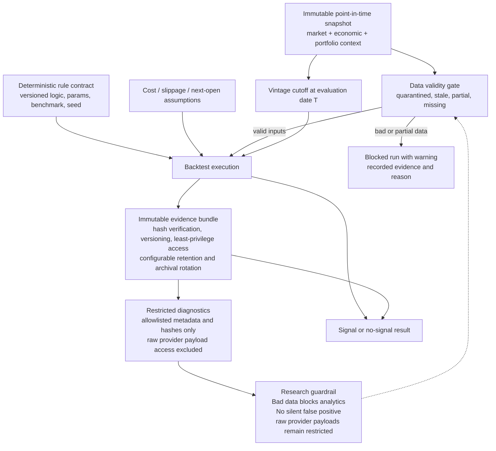

# Proposed Analytics Backtest Activity

## Status
Status: Proposed - pending architecture review and human approval; not an accepted ADR

## Purpose and scope
This activity shows the proposed analytics and backtest execution flow for the ETF prototype. It emphasizes point-in-time snapshots, deterministic rule contracts, explicit vintage cutoff logic, blocked bad-data paths, and evidence-bearing outputs. The design keeps the analysis local, user-controlled, and restricted to research-only conclusions without any brokerage or execution semantics.

## Accessible description
The analytics worker receives a frozen point-in-time snapshot assembled from valid market and economic data. It applies the rule contract, benchmark assumptions, cost and slippage inputs, and next-open assumptions to generate a deterministic result. If the dataset is stale, partial, or quarantined, the worker blocks the run and records a warning. The snapshot, inputs, and code hash are retained in an immutable evidence bundle so the output can be reproduced and challenged. The diagram uses labels and textual notes so the flow is readable without relying on color. Evidence records are immutable and versioned with hash verification, least-privilege access, configurable retention, and controlled archival/rotation; exact duration remains deferred to Ring 1. Diagnostic access is separated from raw provider payloads: operators inspect allowlisted metadata and hashes only, while raw provider data remains restricted and tests prove secrets or prohibited raw payloads are absent.

## Proposed architecture requirements
- Evidence policy: analytics evidence must be immutable and versioned, with hash verification, least-privilege access, configurable retention, and controlled archival/rotation; the exact retention duration remains a Ring 1 decision.
- Diagnostic redaction and access: raw provider payload access remains restricted; operational diagnostics log only allowlisted metadata and hashes and are subject to tests proving secrets and prohibited raw provider data are absent.
- Research safety: stale, partial, or quarantined inputs block analytics and produce a recorded warning rather than a silent false positive.

## Traceability
| Feature file | Rule title | Scenario title | Coverage |
| --- | --- | --- | --- |
| [Objective feature](../../specs/features/Objective-ETF-Trade-Recommendation-Prototype-Requirements.feature) | Rule: Economic data and provider policy | Official economic adapters and provider controls are required and revalidated | Vintage cutoff and observation validity |
| [Objective feature](../../specs/features/Objective-ETF-Trade-Recommendation-Prototype-Requirements.feature) | Rule: Representative acceptance criteria | Vintage cutoff preserves point-in-time truth | Point-in-time snapshot and vintage cutoff |
| [Objective feature](../../specs/features/Objective-ETF-Trade-Recommendation-Prototype-Requirements.feature) | Rule: Representative acceptance criteria | Repeated analytics and backtests are reproducible | Deterministic rule contract and evidence hash |
| [Objective feature](../../specs/features/Objective-ETF-Trade-Recommendation-Prototype-Requirements.feature) | Rule: Representative acceptance criteria | Missing-session data suppresses a signal instead of producing a false positive | Block data and warning semantics |
| [Objective feature](../../specs/features/Objective-ETF-Trade-Recommendation-Prototype-Requirements.feature) | Rule: UX, performance, and provider controls | The UI remains accessible and meets the required gates | Research-only disclaimer and non-color warning communication |

## Source references
- [Objective PDF](../customer-docs/Objective/ETF%20Trade%20Recommendation%20Prototype%20Requirements.pdf)
- [Program narrative](../customer-docs/Objective/program-narrative.md)
- [Objective summary](../customer-docs/Objective/objective-summary.md)

## Risks and assumptions
- The view assumes rule contracts and backtest assumptions are versioned and reproducible for audit and research evaluation.
- Missing, stale, or partial data is treated as a blocking condition rather than a tolerated silent success.
- Cost, slippage, and next-open assumptions must be explicit and reviewed with the snapshot because they materially change the outcome.
- Provider and economic data remain subject to revalidation; no historical provider assessments are treated as permanent truth.

---
