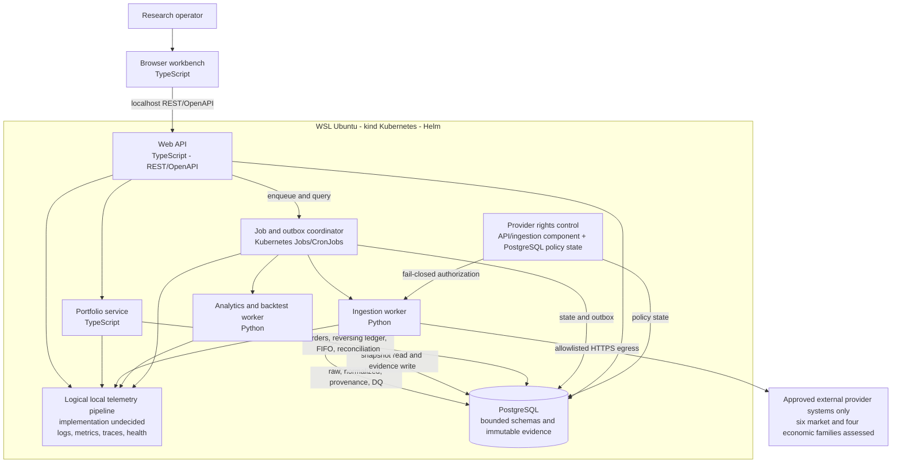

# Proposed C4 Container View

## Status

Status: Proposed - research-only/no-broker; pending architecture review and human approval; not an accepted ADR

## Purpose

This C4 Level 2 view identifies the deployable and persistent containers inside the local ETF Analyzer boundary. It deliberately leaves component logic, deployment topology, domain detail, and workflows to the existing linked views.

## Container diagram

## Accessible prose alternative

| Container | Responsibility | Interfaces and data |
| --- | --- | --- |
| Browser workbench | Accessible local UI for watchlists, research evidence, jobs, backtests, and explicit paper decisions. | Calls the API over localhost REST/OpenAPI; receives no provider credentials. |
| Web API | Validates local requests, exposes OpenAPI contracts, and queries/enqueues work. | TypeScript; communicates with local services, jobs, and PostgreSQL only. |
| Portfolio service | Owns the eight-state local paper-order contract and accounting boundary. | TypeScript; writes immutable transactions and reversing corrections, applies FIFO, and requires exact reconciliation. See the state and sequence views. |
| Ingestion worker | Executes resumable market/economic ingestion after rights and egress gates. | Python; stores raw/normalized provenance, five-part identity plus job idempotency, vintages, and DQ outcomes. |
| Analytics/backtest worker | Executes deterministic rules and P0 backtests against point-in-time snapshots. | Python; records configuration/result hashes and blocks stale, partial, quarantined, or incompatible inputs. |
| Job/outbox coordinator | Provides queued/running/failed/suppressed status, retries, correlation, and durable event handoff. | Kubernetes Jobs/CronJobs plus PostgreSQL outbox; provider outage is an explicit failed job, never zero-row success. |
| Provider rights control | Internal policy component backed by configuration and PostgreSQL policy state; not a separately deployed service. | Allows only current Approved sources and fails closed for Pending, Rejected, expired, or missing status/configuration. |
| PostgreSQL | Local bounded schemas for catalog, market, economics, analytics, portfolio, operations, audit, and evidence. | Bounded numeric types; unique/check constraints; migrations; immutable evidence and transaction history. |
| Logical local telemetry pipeline | Collects structured logs, metrics, traces, health/readiness, and redacted evidence links; the concrete implementation remains a Ring 1 decision. | Local-only endpoints and storage; no raw provider payloads or secrets. |

No container or external relationship exists for brokerage, real orders, credential transmission, public ingress, or unapproved provider access.

## Integration and data rules

- The six market providers and four economic families are an assessment set, not an integration entitlement. Only sources whose rights record is Approved may have enabled endpoints; Pending and Rejected sources have no live call path.
- Fixtures are explicitly selected bootstrap, test, or offline datasets. They are not provider failover. A live provider outage or retry exhaustion fails the job and blocks dependent analytics.
- Market identity is `(instrument, trading date, provider, adjustment policy, revision)` plus idempotency token/job identity. Economic values use release timestamps and the vintage available at or before evaluation time.
- Job/outbox state correlates ingestion, analytics, evidence, audit, and diagnostics without turning events into brokerage commands.
- The portfolio ledger is the source of truth: transactions are immutable, corrections reverse prior entries, lots are FIFO, and cached projections must reconcile exactly to the ledger within configured decimal precision.

## Deployment and scaling posture

All containers run locally under Helm on kind/Kubernetes inside WSL Ubuntu. The prototype favors deterministic bounded jobs and horizontal worker concurrency only where idempotency and the frozen domain/API/schema contract permit it. There is no public load balancer, cloud autoscaling, multi-user capacity target, or HA/DR promise. Detailed pod, migration, PVC, and network placement is owned by the [deployment view](proposed-deployment-view.md).

## Related behavioral views

- [Component view](proposed-component-view.md)
- [Domain model](proposed-domain-model.md)
- [Ingestion sequence](proposed-ingestion-sequence.md)
- [Paper-order sequence](proposed-paper-order-sequence.md)
- [Paper-order state](proposed-paper-order-state.md)
- [Analytics/backtest activity](proposed-analytics-backtest-activity.md)
- [Security view](proposed-security-view.md)
- [Observability view](proposed-observability-view.md)

## Trade-offs and Ring 1 constraints

The split keeps Python close to data/analytics libraries and TypeScript close to API/UI/domain orchestration, at the cost of cross-language contract discipline. Before MAI-ST parallel work, one accountable schema custodian must freeze and version the domain, OpenAPI, database, and outbox contracts. Exact precision/scale, rounding mode, evidence retention, Approved provider statuses, retry limits, and worker sizing remain Ring 1 decisions; no value is accepted by this Proposed view.

---
