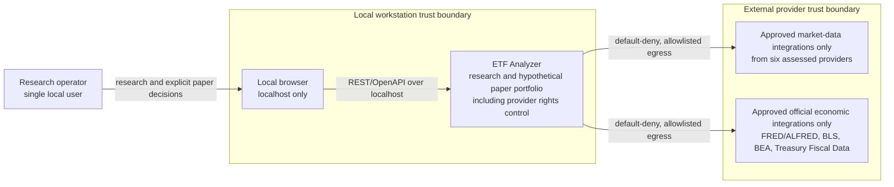

# Proposed C4 System Context

## Status

Status: Proposed - research-only/no-broker; pending architecture review and human approval; not an accepted ADR

## Purpose

This C4 Level 1 view places the ETF Analyzer prototype in its local operating context. It shows people, system boundaries, and permitted external relationships. Detailed internals and workflows remain in the linked lower-level views.

## Context diagram

## Accessible prose alternative

| Element | Relationship and boundary |
| --- | --- |
| Research operator | Uses one local browser for watchlists, evidence review, deterministic analytics/backtests, and explicit hypothetical paper decisions. |
| ETF Analyzer | Local research system only; it has no brokerage connector, real-order endpoint, provider-side paper trading, credential transmission path, or investment-advice authority. |
| WSL Ubuntu / kind | Hosts the Helm-managed Kubernetes runtime and PostgreSQL on the local workstation. Ingress is localhost-only and no public load balancer exists. |
| Market sources | Six providers are assessed: yfinance/Yahoo, Alpha Vantage, Tiingo, Alpaca IEX, EODHD, and Stooq. An adapter may operate only when its status is Approved and current rights evidence permits the intended use. |
| Economic sources | Four official families are assessed: FRED/ALFRED, BLS, BEA, and Treasury Fiscal Data. Only Approved direct integrations may operate. |
| Internal rights control | Records provider, intended use, terms URL/date, persistence/display permissions, quota, status, revalidation, and user choice. Pending or Rejected status fails closed. |

Brokerage, real orders, credential transmission, and public ingress are explicit non-goals with no system relationship. WSL Ubuntu, kind/Kubernetes, Helm, and PostgreSQL are internal deployment details shown in the C4 container and deployment views rather than separate L1 systems.

## System responsibilities

- Maintain watchlists and validated instrument identity without creating execution semantics.
- Ingest only rights-approved data with full provenance, the five-part market identity, idempotent job identity, and visible DQ suppression.
- Preserve economic release timestamps, point-in-time vintages, and separately versioned non-overwriting transformations.
- Run deterministic analytics and backtests from immutable snapshots using inputs, code hash, parameters, seed, benchmark, provider, and environment evidence.
- Maintain a local, immutable transaction ledger corrected only by reversing entries, with FIFO lots and exact reconciliation of cash, lots, positions, realized P&L, valuations, and cached projections at configured decimal precision.
- Keep all signals informational until explicit user confirmation starts the local paper-order lifecycle.

## Scope and NFR boundaries

The canonical targets remain: non-analytical API p95 under 1 second, dashboard first meaningful content under 2 seconds, core workflows usable at 1280x720 and tablet sizes, keyboard and non-color status accessibility, zero unexplained accounting difference within configured precision, reproducible evidence hashes, migration-aware readiness, and fully redacted diagnostics. HA/DR, Azure, public hosting, multi-tenancy, mobile, streaming/intraday feeds, paid data, and real execution are non-goals.

## Related views

- [C4 container view](proposed-c4-container.md)
- [Component view](proposed-component-view.md)
- [Deployment view](proposed-deployment-view.md)
- [Domain model](proposed-domain-model.md)
- [Security view](proposed-security-view.md)
- [Observability view](proposed-observability-view.md)
- [Objective summary](../customer-docs/Objective/objective-summary.md)

## Risks and proposed controls

| Risk | Proposed control |
| --- | --- |
| A provider assessment is mistaken for permission | Provider status defaults to Pending; only explicit, current Approved evidence enables an adapter. |
| Research output is mistaken for execution or advice | Persistent research-only labeling, explicit confirmation, local simulation, and no broker integration or credential path. |
| Historical revisions bias research | Release-time cutoff and point-in-time vintage selection; transformations are versioned rather than overwritten. |
| Local scope is accidentally widened | Localhost-only ingress, default-deny egress, and explicit non-goals remain acceptance controls. |

---
