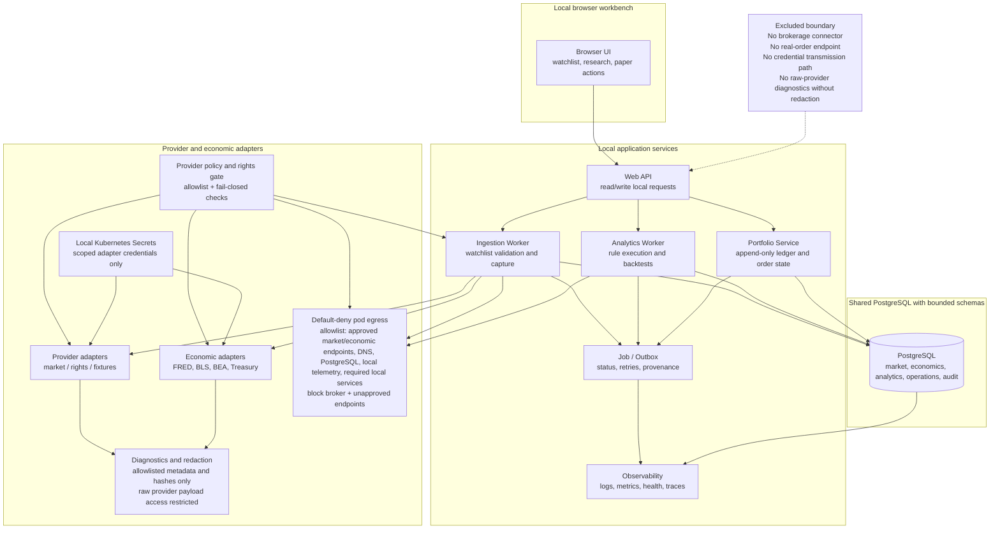

# Proposed Component View

## Status
Status: Proposed - pending architecture review and human approval; not an accepted ADR

## Purpose and scope
This view describes the proposed target architecture for the ETF research prototype as a local-first, single-user browser workbench. It focuses on the validated functional boundaries in the Objective PDF and its legacy migration evidence: a browser UI that calls a local web API, a portfolio service for paper-only accounting, an ingestion worker, an analytics worker, a shared PostgreSQL store with bounded schemas, provider and economic adapters, job/outbox coordination, and observability. It intentionally excludes brokerage connectors, real-order endpoints, and any credential transmission path.

## Accessible description
The system boundary is divided into a browser client, a local web API layer, application services, worker processes, shared storage, and external provider adapters. The browser exchanges only local, read-only or user-confirmed paper actions with the API. The portfolio service owns the append-only ledger and the paper-order lifecycle. The ingestion worker validates symbols, applies provider rights checks, stores raw and normalized observations, and suppresses downstream signal generation when data quality fails. The analytics worker reads the point-in-time snapshot and applies deterministic rule contracts. The shared PostgreSQL instance stores bounded market, economic, analytics, and operational data, while observability components record job state, failures, and evidence hashes. The diagram uses labels and explicit boundaries rather than color to communicate flow. Approved outbound traffic is constrained by a default-deny pod egress policy with an allowlist for rights-approved market and economic provider endpoints, required DNS resolution, PostgreSQL and local telemetry, and required local services; broker and unapproved destinations are blocked, and the policy fails closed when rights or allowlist configuration is absent. Credentials remain only in local Kubernetes Secrets, are mounted only to the scoped adapter workload, are excluded from Git, images, logs, diagnostics, and client bundles, and are subject to CI and infrastructure leak-redaction checks. Diagnostic access is separated from raw provider payload storage so that operators view only allowlisted metadata and hashes while raw payloads remain restricted.

## Proposed architecture requirements
- Controlled egress: default-deny pod egress plus an explicit allowlist for rights-approved market and economic provider endpoints, DNS when required, PostgreSQL and local telemetry, and required local services; broker and unapproved endpoints are denied and the policy fails closed when rights or allowlist configuration is absent; connectivity policy tests are required before readiness.
- Ingestion identity: the authoritative identity of a market record is (instrument, trading date, provider, adjustment policy, revision), combined with an idempotency token/job identity; database unique and check constraints and migration validation are required for both empty and populated datasets instead of assuming a legacy (Symbol, Date) key is sufficient.
- Secret lifecycle: credentials remain only in local Kubernetes Secrets, are mounted or injected only into the scoped adapter workload, are excluded from Git, images, logs, diagnostics, and client bundles, and are covered by CI and infrastructure redaction / leak checks.
- Diagnostic redaction and access: raw provider payload access remains restricted, while operational diagnostics use explicit allowlisted fields, least-privilege operator access, and tests proving that secrets and prohibited raw provider data are absent.
- Evidence policy: immutable, versioned evidence records carry hash verification, least-privilege access, configurable retention, and controlled archival/rotation; the exact duration remains a Ring 1 design decision.
- Financial precision: the portfolio and paper-order model require bounded PostgreSQL numeric types, canonical per-field precision and scale, one documented rounding mode, and reconciliation test vectors; the exact values and rounding mode remain a proposed Ring 1 ADR decision.

## Traceability
| Feature file | Rule title | Scenario title | Coverage |
| --- | --- | --- | --- |
| [Objective feature](../../specs/features/Objective-ETF-Trade-Recommendation-Prototype-Requirements.feature) | Scope and non-goals | The prototype is local-only and excludes execution and streaming features | Local-only boundary, research-only logic, no brokerage semantics |
| [Objective feature](../../specs/features/Objective-ETF-Trade-Recommendation-Prototype-Requirements.feature) | Watchlists, market data, and backfill | A user maintains a watchlist and resumable backfill without creating execution semantics | Browser API, ingestion worker, shared store |
| [Objective feature](../../specs/features/Objective-ETF-Trade-Recommendation-Prototype-Requirements.feature) | Economic data and provider policy | Official economic adapters and provider controls are required and revalidated | Provider and economic adapters, rights gate |
| [Objective feature](../../specs/features/Objective-ETF-Trade-Recommendation-Prototype-Requirements.feature) | Representative acceptance criteria | Clean bootstrap and deploy reaches local readiness | Local K8s and readiness considerations |
| [Legacy ingestion feature](../../specs/features/Legacy-Code-market-data-ingestion.feature) | Migration constraints | The legacy scraping and regex parsing remain historical evidence only | Historical Yahoo fetch is migration evidence only |
| [Legacy operations feature](../../specs/features/Legacy-Code-operations.feature) | Migration gaps and resilience | The legacy flow exposes missing resilience and observability that the target must improve | Observability and failure handling |

## Source references
- [Objective PDF](../customer-docs/Objective/ETF%20Trade%20Recommendation%20Prototype%20Requirements.pdf)
- [Program narrative](../customer-docs/Objective/program-narrative.md)
- [Objective summary](../customer-docs/Objective/objective-summary.md)
- [Legacy requestor](../customer-docs/Legacy-Code/Strategic.DataServices.HtmlParser/Strategic.DataServices.HtmlParser/Requestor.cs)
- [Legacy extractor](../customer-docs/Legacy-Code/Strategic.DataServices.HtmlParser/Strategic.DataServices.HtmlParser/Extractor.cs)
- [Legacy database insert](../customer-docs/Legacy-Code/Strategic.DataServices.HtmlParser/Strategic.DataServices.Database/ETFDb.cs)
- [Legacy form tester](../customer-docs/Legacy-Code/Strategic.DataServices.HtmlParser/Strategic.DataServices.ClientTester/Form1.cs)

## Risks and assumptions
- Provider assessments are time-bound and must be revalidated before production use.
- The proposed design assumes metadata and rights controls are enforced before any ingestion from a provider.
- This is a proposed architecture only; no accepted ADR or production runtime decision is implied.
- Legacy Yahoo HTTP, regex parsing, and SQL Server bindings are historical evidence and are not target components.
- Local WSL and kind usage is assumed to satisfy the prototype workload and single-user boundary without public internet exposure.

---
