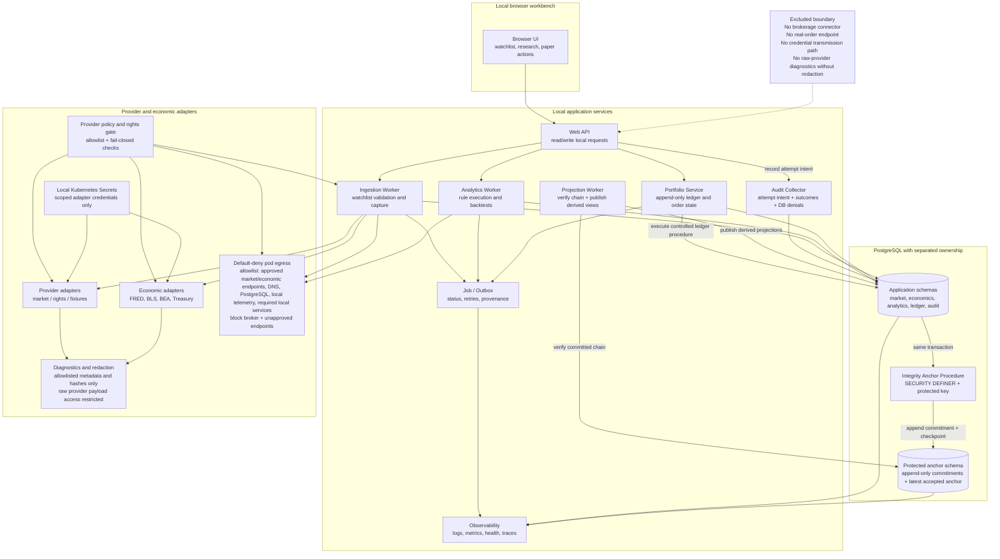

# Proposed Component View

## Status
Status: Ledger-security design accepted at DP-33; remaining content Proposed; not an accepted ADR

## Purpose and scope
This view describes the proposed target architecture for the ETF research prototype as a local-first, single-user browser workbench. It focuses on the validated functional boundaries in the Objective PDF and its legacy migration evidence: a browser UI that calls a local web API, a portfolio service for paper-only accounting, an integrity-anchor procedure, an ingestion worker, an analytics worker, PostgreSQL with separately owned ledger and anchor schemas, provider and economic adapters, job/outbox coordination, and observability. It intentionally excludes brokerage connectors, real-order endpoints, and any credential transmission path.

## Accessible description
The system boundary is divided into a browser client, a local web API layer, application services, worker processes, separately authorized data schemas, and external provider adapters. The browser exchanges only local, read-only or user-confirmed paper actions with the API. The portfolio service owns the paper-order lifecycle and can execute controlled ledger procedures but has no table privileges. Inside PostgreSQL, the controlled ledger procedure invokes an anchor-owner `SECURITY DEFINER` procedure in the same transaction; that procedure reads a protected versioned key, computes HMAC-SHA-256, and appends the commitment and latest-anchor checkpoint. The portfolio, ledger writer, and projection writer cannot read the key or anchor tables. A projection worker verifies the committed chain before publishing derived projections. An audit collector commits immutable attempt-intent evidence before business processing and appends outcomes afterward, so crashes leave detectable unresolved attempts. PostgreSQL stores bounded market, economic, analytics, ledger, protected-anchor, and operational data under distinct ownership roles, while observability records failures, integrity verification, and evidence hashes.

## Proposed architecture requirements
- Controlled egress: default-deny pod egress plus an explicit allowlist for rights-approved market and economic provider endpoints, DNS when required, PostgreSQL and local telemetry, and required local services; broker and unapproved endpoints are denied and the policy fails closed when rights or allowlist configuration is absent; connectivity policy tests are required before readiness.
- Ingestion identity: the authoritative identity of a market record is (instrument, trading date, provider, adjustment policy, revision), combined with an idempotency token/job identity; database unique and check constraints and migration validation are required for both empty and populated datasets instead of assuming a legacy (Symbol, Date) key is sufficient.
- Secret lifecycle: credentials remain only in local Kubernetes Secrets, are mounted or injected only into the scoped adapter workload, are excluded from Git, images, logs, diagnostics, and client bundles, and are covered by CI and infrastructure redaction / leak checks.
- Diagnostic redaction and access: raw provider payload access remains restricted, while operational diagnostics use explicit allowlisted fields, least-privilege operator access, and tests proving that secrets and prohibited raw provider data are absent.
- Evidence policy: immutable, versioned evidence records carry hash verification, least-privilege access, configurable retention, and controlled archival/rotation; the exact duration remains a Ring 1 design decision.
- Financial precision: DEC-014 Option A is authoritative: `NUMERIC(28,10)` quantity/unit value, `NUMERIC(28,8)` money, and `NUMERIC(28,12)` rates/ratios with decimal round-half-even and exact canonical equality; no epsilon is permitted. Implementation libraries and executable vectors remain Ring 2 obligations.
- Ledger authority: runtime workloads receive only approved reads and controlled-procedure execution. `schema_owner`, `ledger_writer_owner`, `projection_owner`, `migration_owner`, `audit_writer_owner`, and `anchor_owner` are distinct `NOLOGIN` roles; inheritance and `PUBLIC` access are revoked, and runtime has no direct DML, sequence, `COPY`, `TRUNCATE`, trigger, DDL, ownership, or role-administration privilege.
- Integrity anchoring: only the anchor-owner `SECURITY DEFINER` procedure reads the protected versioned key and appends the commitment/checkpoint. The controlled ledger procedure may invoke it inside the same transaction but cannot read key or anchor tables. Projection publication is a separate projection-worker transaction after committed-chain verification.
- Durable attempt audit: the audit collector commits an immutable attempt-intent record before invoking business processing. Success completion audit is atomic with ledger commit; rejection, permission-denial, crash-timeout, and recovery outcomes append immutable records referencing the intent. Unresolved intents are visible and reconciled by a bounded collector job.
- Accessible ledger status: the browser UI owns one persistent semantic status region. Pending and recovery-in-progress are persistent states whose updates use `role="status"` with polite announcements; integrity-blocked publication is a persistent state whose updates use `role="alert"` for an assertive announcement. Each state includes visible non-color text, a plain explanation, and a keyboard-operable recovery action. `RecoveryCompleted` produces a transient polite completion announcement and clears the persistent recovery state after focus-safe acknowledgement.

## Traceability
| Feature file | Rule title | Scenario title | Coverage |
| --- | --- | --- | --- |
| [Objective feature](../../specs/features/Objective-ETF-Trade-Recommendation-Prototype-Requirements.feature) | Scope and non-goals | The prototype is local-only and excludes execution and streaming features | Local-only boundary, research-only logic, no brokerage semantics |
| [Objective feature](../../specs/features/Objective-ETF-Trade-Recommendation-Prototype-Requirements.feature) | Watchlists, market data, and backfill | A user maintains a watchlist and resumable backfill without creating execution semantics | Browser API, ingestion worker, shared store |
| [Objective feature](../../specs/features/Objective-ETF-Trade-Recommendation-Prototype-Requirements.feature) | Economic data and provider policy | Official economic adapters and provider controls are required and revalidated | Provider and economic adapters, rights gate |
| [Objective feature](../../specs/features/Objective-ETF-Trade-Recommendation-Prototype-Requirements.feature) | Representative acceptance criteria | Clean bootstrap and deploy reaches local readiness | Local K8s and readiness considerations |
| [Legacy ingestion feature](../../specs/features/Legacy-Code-market-data-ingestion.feature) | Migration constraints | The legacy scraping and regex parsing remain historical evidence only | Historical Yahoo fetch is migration evidence only |
| [Legacy operations feature](../../specs/features/Legacy-Code-operations.feature) | Migration gaps and resilience | The legacy flow exposes missing resilience and observability that the target must improve | Observability and failure handling |

## Source references
- [Objective PDF](../customer-docs/Objective/ETF%20Trade%20Recommendation%20Prototype%20Requirements.pdf)
- [Program narrative](../customer-docs/Objective/program-narrative.md)
- [Objective summary](../customer-docs/Objective/objective-summary.md)
- [Legacy requestor](../customer-docs/Legacy-Code/Strategic.DataServices.HtmlParser/Strategic.DataServices.HtmlParser/Requestor.cs)
- [Legacy extractor](../customer-docs/Legacy-Code/Strategic.DataServices.HtmlParser/Strategic.DataServices.HtmlParser/Extractor.cs)
- [Legacy database insert](../customer-docs/Legacy-Code/Strategic.DataServices.HtmlParser/Strategic.DataServices.Database/ETFDb.cs)
- [Legacy form tester](../customer-docs/Legacy-Code/Strategic.DataServices.HtmlParser/Strategic.DataServices.ClientTester/Form1.cs)

## Risks and assumptions
- Provider assessments are time-bound and must be revalidated before production use.
- The proposed design assumes metadata and rights controls are enforced before any ingestion from a provider.
- This is a proposed architecture only; no accepted ADR or production runtime decision is implied.
- Legacy Yahoo HTTP, regex parsing, and SQL Server bindings are historical evidence and are not target components.
- Local WSL and kind usage is assumed to satisfy the prototype workload and single-user boundary without public internet exposure.

---
