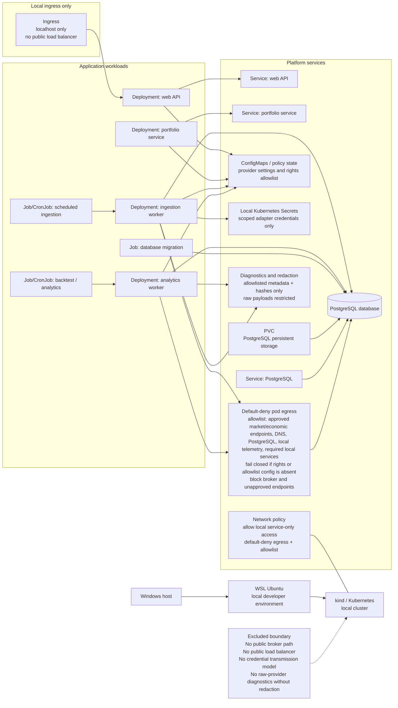

# Proposed Deployment View

## Status
Status: Proposed - pending architecture review and human approval; not an accepted ADR

## Purpose and scope
This deployment view shows the proposed target platform for the prototype: a Windows host running a local WSL Ubuntu environment that hosts a kind-based Kubernetes control plane, with ingress limited to localhost only. The design keeps the application local-first and research-only, with no public load balancer, no internet-facing broker endpoint, and no order transmission path. It includes application deployments, jobs, cronjobs, services, ConfigMaps and Secrets, a migration job, network policy, and PostgreSQL persistence via PVC-backed storage.

## Accessible description
The Windows host is the developer workstation boundary. It runs WSL Ubuntu, which hosts the Kubernetes cluster used for local development and validation. Inside the cluster, browser access is limited to localhost ingress. The application is decomposed into deployments for the web API, portfolio service, ingestion worker, and analytics worker; scheduled jobs or cronjobs run key ingestion and backtest work; a migration job applies schema changes before readiness; and a local PostgreSQL instance uses a persistent volume claim for durable data. Network policy restricts intra-cluster traffic to the required service paths while keeping the deployment local-only and non-public. Labels and explicit text define boundaries, not color. Default-deny pod egress is enforced with an explicit allowlist for rights-approved market and economic provider endpoints, required DNS resolution, PostgreSQL and local telemetry, and required local services; broker or unapproved endpoints are denied, and the policy fails closed when rights or allowlist configuration is absent. Credentials are limited to local Kubernetes Secrets, mounted only into the scoped adapter workload; they are excluded from Git, images, logs, diagnostics, and client bundles and are checked by CI and infrastructure redaction leak tests. Raw provider payload access is separated from operational evidence and diagnostics that record only allowlisted metadata and hashes.

## Proposed architecture requirements
- Controlled egress: default-deny pod egress is required for all workloads, with an explicit allowlist for rights-approved market and economic provider endpoints, DNS when required, PostgreSQL and local telemetry, and required local services; broker and unapproved endpoints are denied, the policy fails closed if rights or allowlist configuration is missing, and connectivity policy tests are required before readiness.
- Secret lifecycle: credentials live only in local Kubernetes Secrets, are mounted or injected only into the scoped adapter workload, are excluded from Git, images, logs, diagnostics, and client bundles, and are covered by CI and infrastructure redaction / leak checks.
- Diagnostic redaction and access: raw provider payload access remains restricted while operator diagnostics use allowlisted fields, least-privilege access, and tests that prove secrets and prohibited raw provider data are absent.
- Evidence policy: analytics outputs retain immutable, versioned evidence records with hash verification, least-privilege access, configurable retention, and controlled archival/rotation; the exact duration remains a Ring 1 design decision.
- Financial precision: the ledger and reconciliation path require bounded PostgreSQL numeric types, canonical per-field precision and scale, a single documented rounding mode, and reconciliation test vectors; the exact values and rounding mode remain a proposed Ring 1 ADR decision.

## Traceability
| Feature file | Rule title | Scenario title | Coverage |
| --- | --- | --- | --- |
| [Objective feature](../../specs/features/Objective-ETF-Trade-Recommendation-Prototype-Requirements.feature) | Scope and non-goals | The prototype is local-only and excludes execution and streaming features | Local deployment, no public load balancer, research-only boundary |
| [Objective feature](../../specs/features/Objective-ETF-Trade-Recommendation-Prototype-Requirements.feature) | Representative acceptance criteria | Clean bootstrap and deploy reaches local readiness | Local cluster readiness, migration, PostgreSQL, integration smoke checks |
| [Objective feature](../../specs/features/Objective-ETF-Trade-Recommendation-Prototype-Requirements.feature) | UX, performance, and provider controls | The UI remains accessible and meets the required gates | Local desktop usage and ingress-only access |
| [Legacy operations feature](../../specs/features/Legacy-Code-operations.feature) | Console entry-point behavior | The legacy quote service derives a default lookback and optional day-count or end-date values | Historical manual console pattern is not a target deployment contract |

## Source references
- [Objective PDF](../customer-docs/Objective/ETF%20Trade%20Recommendation%20Prototype%20Requirements.pdf)
- [Program narrative](../customer-docs/Objective/program-narrative.md)
- [Objective summary](../customer-docs/Objective/objective-summary.md)
- [Legacy Program.cs](../customer-docs/Legacy-Code/Strategic.DataServices.HtmlParser/Strategic.DataServices.YahooQuoteService/Program.cs)
- [Legacy form tester](../customer-docs/Legacy-Code/Strategic.DataServices.HtmlParser/Strategic.DataServices.ClientTester/Form1.cs)

## Risks and assumptions
- The design assumes a single-user local Kubernetes environment is sufficient for the objective without a production-grade internet ingress.
- Provider settings, quotas, and terms are assumed to be enforced before a job can run, but they remain subject to time-bound revalidation.
- Kubernetes readiness must include migration completion and required database connectivity before any analytical path can start.
- No external broker or public data path is part of this proposal; this is a deliberate boundary to preserve research-only semantics.

---
