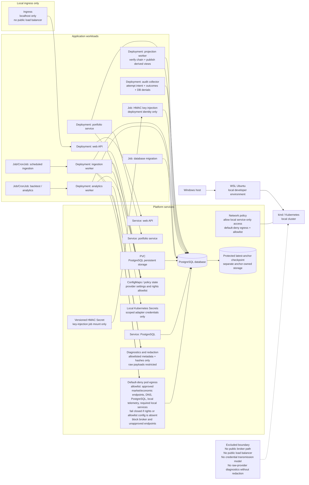

# Proposed Deployment View

## Status
Status: Ledger-security design accepted at DP-33; remaining content Proposed; not an accepted ADR

## Purpose and scope
This deployment view shows the proposed target platform for the prototype: a Windows host running a local WSL Ubuntu environment that hosts a kind-based Kubernetes control plane, with ingress limited to localhost only. The design keeps the application local-first and research-only, with no public load balancer, no internet-facing broker endpoint, and no order transmission path. It includes application deployments, jobs, cronjobs, services, ConfigMaps and Secrets, a migration job, network policy, and PostgreSQL persistence via PVC-backed storage.

## Accessible description
The Windows host is the developer workstation boundary. It runs WSL Ubuntu, which hosts the Kubernetes cluster used for local development and validation. Inside the cluster, browser access is limited to localhost ingress. The application is decomposed into deployments for the web API, portfolio service, ingestion worker, and analytics worker; scheduled jobs or cronjobs run key ingestion and backtest work; a migration job applies schema changes before readiness; and a local PostgreSQL instance uses a persistent volume claim for durable data. Network policy restricts intra-cluster traffic to the required service paths while keeping the deployment local-only and non-public. Labels and explicit text define boundaries, not color. Default-deny pod egress is enforced with an explicit allowlist for rights-approved market and economic provider endpoints, required DNS resolution, PostgreSQL and local telemetry, and required local services; broker or unapproved endpoints are denied, and the policy fails closed when rights or allowlist configuration is absent. Credentials are limited to local Kubernetes Secrets, mounted only into the scoped adapter workload; they are excluded from Git, images, logs, diagnostics, and client bundles and are checked by CI and infrastructure redaction leak tests. Raw provider payload access is separated from operational evidence and diagnostics that record only allowlisted metadata and hashes.

## Proposed architecture requirements
- Controlled egress: default-deny pod egress is required for all workloads, with an explicit allowlist for rights-approved market and economic provider endpoints, DNS when required, PostgreSQL and local telemetry, and required local services; broker and unapproved endpoints are denied, the policy fails closed if rights or allowlist configuration is missing, and connectivity policy tests are required before readiness.
- Secret lifecycle: credentials live only in local Kubernetes Secrets, are mounted or injected only into the scoped adapter workload, are excluded from Git, images, logs, diagnostics, and client bundles, and are covered by CI and infrastructure redaction / leak checks.
- Diagnostic redaction and access: raw provider payload access remains restricted while operator diagnostics use allowlisted fields, least-privilege access, and tests that prove secrets and prohibited raw provider data are absent.
- Evidence policy: analytics outputs retain immutable, versioned evidence records with hash verification, least-privilege access, configurable retention, and controlled archival/rotation; the exact duration remains a Ring 1 design decision.
- Financial precision: DEC-014 Option A fixes `NUMERIC(28,10)` quantity/unit value, `NUMERIC(28,8)` money, and `NUMERIC(28,12)` rates/ratios with decimal round-half-even and exact no-epsilon reconciliation.
- Workload identity: Kubernetes service accounts map one-to-one to PostgreSQL `NOINHERIT` login roles for runtime API/portfolio, migration, projection, audit collector, and key injection. `schema_owner`, `ledger_writer_owner`, `projection_owner`, `migration_owner`, `audit_writer_owner`, and `anchor_owner` are separate `NOLOGIN` roles; only the deployment identity may assume migration authority.
- Signer isolation: the versioned HMAC Secret is mounted read-only only into a deployment-time key-injection job and removed after successful injection into the anchor-owner-only PostgreSQL key store. The in-database anchor procedure alone can read key material and append protected commitments/checkpoints; application, audit, and projection workloads have no secret mount or anchor-table access.
- Readiness: ledger projection readiness stays false until migrations complete, the commitment chain verifies from a trusted checkpoint, the configured key identifier is available, and PostgreSQL and the separately protected latest-anchor checkpoint agree.

## Role and deployment mapping

| Kubernetes identity | PostgreSQL login / owner | Allowed | Explicitly denied |
| --- | --- | --- | --- |
| Database schema and immutable table ownership | none / `schema_owner` (`NOLOGIN`) | Own application schemas and immutable base tables; grant only the reviewed procedure/read privileges | Login, runtime assumption, application requests, key reads, and direct external execution |
| API and portfolio service account | `app_runtime` / none | Approved reads; execute controlled order/ledger procedures | Direct anchor execution; table DML, sequences, DDL, triggers, `COPY`, `TRUNCATE`, ownership, role administration, key/anchor access |
| In-database controlled ledger procedure | none / `ledger_writer_owner` (`NOLOGIN`) | `SECURITY DEFINER`; write the atomic ledger unit; execute the anchor procedure as its function owner | Login, key/table reads in anchor schema, accepted-anchor update/delete, projection writes |
| Projection worker service account | `projection_runtime` / none | Verify committed chain; execute the controlled projection procedure | Direct projection/audit/anchor DML, direct audit/anchor execution, and HMAC key access |
| In-database controlled projection procedure | none / `projection_owner` (`NOLOGIN`) | `SECURITY DEFINER`; after successful verification, atomically replace projections and append `PublicationCompleted`; after failed verification, leave projections unchanged and atomically append `BlockedPublication` | Login, other audit outcomes, ledger/anchor mutation, and HMAC key access |
| In-database anchor procedure | none / `anchor_owner` (`NOLOGIN`) | Read protected key; append commitment and latest checkpoint when invoked by `ledger_writer_owner` or `audit_writer_owner` in the same transaction | Login, direct external execution, ledger business DML, accepted-anchor update/delete, projection writes |
| Migration job service account | `migration_executor` / `migration_owner` (`NOLOGIN`) | Time-bounded deployment-only migrations and grants | Runtime use, application requests, HMAC key access |
| HMAC key-injection job service account | `key_injector` / none | Execute one key-injection procedure during deployment/rotation | Ledger/projection/audit DML, anchor replacement, runtime use |
| Audit collector service account | `audit_runtime` / none | Execute the controlled audit procedure; read unresolved-intent status | Direct anchor execution, business DML, anchor replacement, raw SQL-value export |
| In-database controlled audit procedure | none / `audit_writer_owner` (`NOLOGIN`) | `SECURITY DEFINER`; append audit intent/outcome and audit-chain commitment atomically; execute anchor procedure as its function owner | Login, ledger/projection DML, key/table reads in anchor schema, accepted-anchor update/delete |

`PUBLIC` receives no schema, table, sequence, or procedure privilege. Every `SECURITY DEFINER` procedure fixes a trusted `search_path`, fully qualifies objects, validates parameters before casts or DML, and avoids caller-derived dynamic SQL. `app_runtime`, `projection_runtime`, and `audit_runtime` may execute only their respective parent procedures. The audit procedure grants `EXECUTE` to `projection_owner` only for nested `BlockedPublication` and `PublicationCompleted`, validated against current function-owner identity before persistence. The anchor procedure grants `EXECUTE` only to `ledger_writer_owner` and `audit_writer_owner`. PostgreSQL evaluates nested calls as those non-login function owners, while runtime logins have no direct audit or anchor grant. Each parent and nested invocation remains in the caller's single transaction.

## Backup and recovery continuity

- Daily and post-key-rotation backup sets include PostgreSQL data, commitment/rotation evidence, protected latest-anchor checkpoints, key identifiers, and recoverable HMAC key bytes on encrypted storage. `anchor_keys.key_ciphertext` is the legacy physical name for usable HMAC key bytes, not application-wrapped ciphertext. Key material and anchors use a protection domain unavailable to application and ledger-writer identities.
- Prototype targets are RPO 24 hours and RTO 4 hours. A paper action is not declared durable for recovery purposes until its protected checkpoint is included in the next successful backup; the UI exposes the latest protected backup time.
- Backup export uses one PostgreSQL 16 repeatable-read snapshot: the anchor owner derives and signs the manifest while holding the shared integrity gate, exports that transaction snapshot, and keeps it open until the backup reader has imported and completed the snapshot. Restore order is keys and key metadata, signed manifest, PostgreSQL/PVC data from that same backup identity, then full chain verification. Readiness and projection publication remain false until anti-rollback comparison and full retained-history verification succeed.
- PVC loss and workstation reconstruction restore from the same coherent set. Rotation-in-progress recovery retains both key versions and resumes from the last verified predecessor. A database older than the protected checkpoint, or a checkpoint older than the declared backup set, fails closed and requires explicit operator recovery rather than silent truncation.

## Traceability
| Feature file | Rule title | Scenario title | Coverage |
| --- | --- | --- | --- |
| [Objective feature](../../specs/features/Objective-ETF-Trade-Recommendation-Prototype-Requirements.feature) | Scope and non-goals | The prototype is local-only and excludes execution and streaming features | Local deployment, no public load balancer, research-only boundary |
| [Objective feature](../../specs/features/Objective-ETF-Trade-Recommendation-Prototype-Requirements.feature) | Representative acceptance criteria | Clean bootstrap and deploy reaches local readiness | Local cluster readiness, migration, PostgreSQL, integration smoke checks |
| [Objective feature](../../specs/features/Objective-ETF-Trade-Recommendation-Prototype-Requirements.feature) | UX, performance, and provider controls | The UI remains accessible and meets the required gates | Local desktop usage and ingress-only access |
| [Legacy operations feature](../../specs/features/Legacy-Code-operations.feature) | Console entry-point behavior | The legacy quote service derives a default lookback and optional day-count or end-date values | Historical manual console pattern is not a target deployment contract |

## Source references
- [Objective PDF](../customer-docs/Objective/ETF%20Trade%20Recommendation%20Prototype%20Requirements.pdf)
- [Program narrative](../customer-docs/Objective/program-narrative.md)
- [Objective summary](../customer-docs/Objective/objective-summary.md)
- [Legacy Program.cs](../customer-docs/Legacy-Code/Strategic.DataServices.HtmlParser/Strategic.DataServices.YahooQuoteService/Program.cs)
- [Legacy form tester](../customer-docs/Legacy-Code/Strategic.DataServices.HtmlParser/Strategic.DataServices.ClientTester/Form1.cs)

## Risks and assumptions
- The design assumes a single-user local Kubernetes environment is sufficient for the objective without a production-grade internet ingress.
- Provider settings, quotas, and terms are assumed to be enforced before a job can run, but they remain subject to time-bound revalidation.
- Kubernetes readiness must include migration completion and required database connectivity before any analytical path can start.
- No external broker or public data path is part of this proposal; this is a deliberate boundary to preserve research-only semantics.
- Local host loss is recoverable only to the stated RPO/RTO when the encrypted key/anchor backup set is stored outside the lost PVC and verified by restore testing.

---
