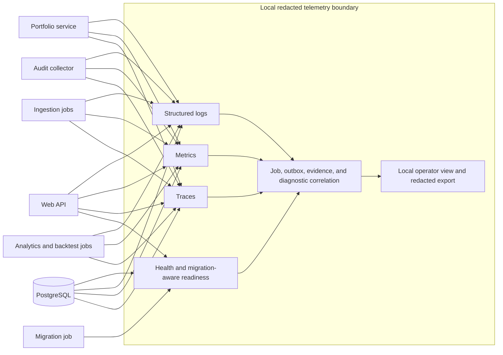

# Proposed Observability View

## Status

Status: Ledger-security design accepted at DP-33; remaining content Proposed; research-only/no-broker; not an accepted ADR

## Purpose

This view defines local observability responsibilities for jobs, APIs, data quality, analytics, evidence, portfolio accounting, and platform readiness. It preserves the canonical objective NFRs without implying production-scale monitoring or cloud services.

## Observability diagram

## Accessible prose alternative

Every API request and bounded job emits redacted logs, metrics, and trace context. A correlation chain links request ID, job ID, outbox event ID, data snapshot/configuration hash, evidence ID/result hash, and diagnostic bundle ID without carrying secrets or raw provider payloads. Liveness reports process health only. Readiness remains false until required PostgreSQL connectivity succeeds, migrations complete exactly once, required policy/configuration is valid, and connectivity-policy checks pass. Provider failure affects the job and dependent research, not basic process liveness.

## Telemetry contract

| Signal | Minimum content | Explicit exclusions |
| --- | --- | --- |
| Structured logs | UTC timestamp, severity, service, operation, request/job ID, provider identifier, status, attempt, row counts, DQ outcome, sanitized error class, duration, evidence ID/hash. | Credentials, authorization headers, query secrets, raw provider payloads, prohibited provider data, free-form financial records, brokerage artifacts. |
| Metrics | Request/job counts and duration, failures, retries, suppression/quarantine, queue/outbox depth and age, rows accepted/rejected, readiness state, migration state, DB connectivity, reconciliation difference, evidence-hash mismatch. | High-cardinality secrets, raw symbols where avoidable, payload fragments, or user-entered content. |
| Ledger integrity | Commitment sequence, key identifier class, verification outcome, unresolved-intent age/count, blocked-publication count, restore verification status, and sanitized failure class. | HMAC key bytes, canonical financial payloads, raw digests that expose sensitive identifiers, or caller-supplied error text. |
| Traces | Local request-to-service-to-job/outbox-to-database spans; provider calls represented by endpoint class and provider identifier; evidence correlation. | Request/response bodies, credentials, raw SQL values, raw provider records. |
| Health | Separate liveness and readiness; migration-aware readiness includes required DB connectivity, completed schema migration, policy/config validity, and local dependency checks. | A successful health response must not imply provider rights, dataset freshness, or analytical validity. |
| Diagnostics | Allowlisted configuration metadata, versions, statuses, timestamps, correlation IDs, counts, hashes, and sanitized failure reasons. | API keys, passwords, prohibited raw provider data, credentials, and any brokerage artifact. |

## Four Golden Signals

Targets are local prototype targets and Proposed until Ring 1 defines measurement windows and alert thresholds.

| Golden signal | Local indicator and target | Proposed owner | Response |
| --- | --- | --- | --- |
| Latency | Non-analytical API p95 under 1 second; dashboard first meaningful content under 2 seconds; job durations tracked by type. | API/UI owner; job owner | Investigate trace spans, DB timing, queue age, and input size; do not weaken determinism or DQ gates. |
| Traffic | Local request rate, job starts/completions, rows processed, and backtest runs; no scale target beyond one local operator. | Application owner | Detect unexpected loops, duplicate submissions, or provider quota pressure. |
| Errors | API 5xx/4xx by class, explicit job failures, retry exhaustion, DQ suppression, hash mismatch, failed migration/readiness, and non-zero reconciliation difference. Provider outage must be a failed job, never zero-row success. | Owning service plus local operator | Block dependent research, preserve redacted evidence, and expose a recoverable reason. |
| Saturation | Queue/outbox depth and oldest age, worker concurrency, CPU/memory, PostgreSQL connections/storage, PVC capacity, and provider quota remaining. | Local platform owner | Throttle or pause bounded jobs; never bypass rights, fixture, provenance, or reconciliation controls. |

## Canonical operational evidence

- Repeated analytics/backtests with identical snapshot, code hash, parameters, environment, and seed produce matching configuration/result hashes.
- Reconciliation uses exact canonical equality after DEC-014 quantization across cash, lots, positions, basis, realized and unrealized P&L, valuations, and cached projections; every difference is zero and no epsilon is permitted.
- Distinct redacted signals identify transaction/effect digest mismatch, allocation/audit digest mismatch, chain break, unknown/retired key identifier, HMAC failure, missing/stale protected anchor, checkpoint lag, anti-rollback failure, and blocked projection publication.
- Stale, partial, quarantined, or incompatible data produces a visible blocking status and suppression metric rather than a valid signal.
- A clean bootstrap proves migrations apply once, fixture data loads only in explicit bootstrap mode, pods become ready, and the localhost browser slice works.
- Backup/restore evidence demonstrates a coherent restore of PostgreSQL, commitments, rotation evidence, protected checkpoints, key identifiers, and recoverable encrypted key versions. The local prototype target is RPO 24 hours and RTO 4 hours; readiness remains false until anti-rollback comparison and full retained-chain verification pass.
- Accessibility status is observable through test evidence for keyboard navigation, visible focus, semantic labels/headings, non-color cues, persistent research disclaimer, 1280x720 usability, and distinct trade/source/retrieval/completion timestamps. The browser-owned semantic status region exposes the three persistent publication states: pending and recovery-in-progress through polite `role="status"` announcements, and blocked-publication through an assertive `role="alert"`. `RecoveryCompleted` is a polite completion announcement that clears recovery-in-progress after focus-safe acknowledgement; every state has plain remediation text and a keyboard-operable action where recovery is available.

## Correlation and redaction rules

Correlation identifiers are generated locally and propagated through REST/OpenAPI, job metadata, outbox records, traces, evidence, audit, and diagnostics. They must not encode credentials, provider payloads, user-entered values, or brokerage semantics. Redaction occurs before telemetry leaves each process; the local collector performs a second allowlist check before display/export. If either stage cannot classify a field, it is omitted and the diagnostic export fails closed.

## Related views

- [C4 container view](proposed-c4-container.md)
- [Component view](proposed-component-view.md)
- [Deployment view](proposed-deployment-view.md)
- [Ingestion sequence](proposed-ingestion-sequence.md)
- [Analytics/backtest activity](proposed-analytics-backtest-activity.md)
- [Paper-order sequence](proposed-paper-order-sequence.md)
- [Security view](proposed-security-view.md)

## Residual observability decisions

Ring 1 must select the local telemetry implementation, metric names/units, histogram buckets, retention/rotation, dashboard layout, alert thresholds, trace sampling, backup tooling, and accountable named operators. These decisions may not relax DEC-014 equality, anchor-procedure/key isolation, anchor continuity, canonical latency, readiness, redaction, outage, reproducibility, accessibility, or reconciliation gates.

---
