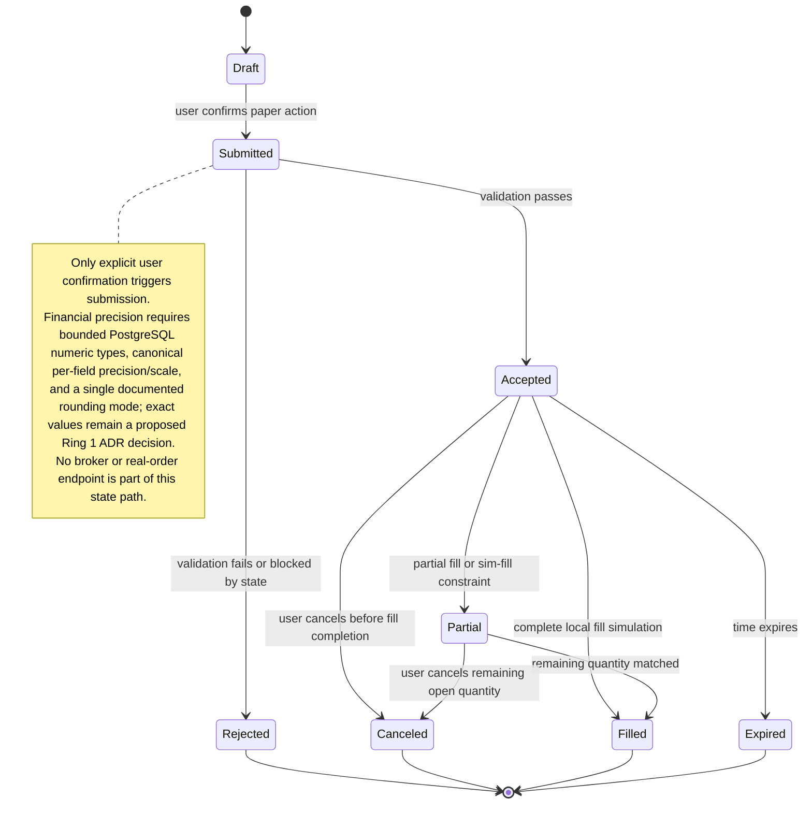

# Proposed Paper Order State

## Status
Status: Proposed - pending architecture review and human approval; not an accepted ADR

## Purpose and scope
This state model defines the proposed lifecycle for a paper order in the research-only ETF prototype. It captures the required progression from Draft to Submitted only after explicit user confirmation, followed by accepted, partial, filled, rejected, canceled, and expired states as described in the Objective PDF. The model keeps the user in control and does not permit a brokerage path or real-order transmission.

## Accessible description
The system begins in Draft state when a user initiates a paper order from a displayed signal. The state remains Draft until the user specifically confirms the order. After confirmation, the order may be submitted and then evaluated by the portfolio rules. Accepted, partial, filled, rejected, canceled, and expired outcomes are all local states with ledger and audit consequences. The model is explained via the state names and transitions in the text; no color or icon is used to communicate status. Financial precision is enforced at the ledger boundary via bounded PostgreSQL numeric types, canonical per-field precision and scale, and a single documented rounding mode, while exact values and rounding mode remain proposed Ring 1 ADR decisions.

Required transition set: initial state to Draft; Draft to Submitted; Submitted to Accepted or Rejected; Accepted to Partial, Filled, Canceled, or Expired; Partial to Filled or Canceled; Filled, Rejected, Canceled, and Expired to the terminal state.

## Proposed architecture requirements
- Financial precision: the paper-order ledger and reconciliation path require bounded PostgreSQL numeric types, canonical per-field precision and scale, one documented rounding mode, and reconciliation test vectors; exact values and rounding mode remain a proposed Ring 1 ADR decision.
- Research-only state semantics: the state model remains local-only and non-brokered; accepted, partial, filled, rejected, canceled, and expired states are local ledger and audit outcomes without real-order transmission or execution.

## Traceability
| Feature file | Rule title | Scenario title | Coverage |
| --- | --- | --- | --- |
| [Objective feature](../../specs/features/Objective-ETF-Trade-Recommendation-Prototype-Requirements.feature) | Rule: Scope and non-goals | The prototype is local-only and excludes execution and streaming features | Research-only and no real execution semantics |
| [Objective feature](../../specs/features/Objective-ETF-Trade-Recommendation-Prototype-Requirements.feature) | Rule: Representative acceptance criteria | An unconfirmed paper order remains draft | Draft lifecycle before confirmation |
| [Objective feature](../../specs/features/Objective-ETF-Trade-Recommendation-Prototype-Requirements.feature) | Rule: Representative acceptance criteria | The portfolio ledger rebuilds exactly within configured decimal precision | Reconciliation and post-fill valuation |
| [Objective feature](../../specs/features/Objective-ETF-Trade-Recommendation-Prototype-Requirements.feature) | Rule: UX, performance, and provider controls | The UI remains accessible and meets the required gates | Non-color state communication and confirmation rules |

## Source references
- [Objective PDF](../customer-docs/Objective/ETF%20Trade%20Recommendation%20Prototype%20Requirements.pdf)
- [Program narrative](../customer-docs/Objective/program-narrative.md)
- [Objective summary](../customer-docs/Objective/objective-summary.md)

## Risks and assumptions
- The state machine assumes the ledger and portfolio service are authoritative; actual brokerage systems are out of scope.
- Only explicit user confirmation is allowed to move an order from Draft to Submitted.
- Partial, accepted, rejected, canceled, and expired states require local business rules and clear audit records.
- This design deliberately does not include live order routing, provider-side paper trading, or any real network counterpart.

---
