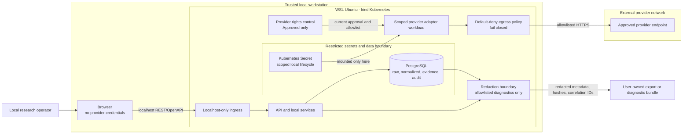

# Proposed Security View

## Status

Status: Proposed - research-only/no-broker; pending security and architecture review and human approval; not an accepted ADR

## Purpose

This view consolidates security boundaries and controls for the local prototype. It supplements, rather than repeats, the detailed [deployment](proposed-deployment-view.md), [component](proposed-component-view.md), and [ingestion](proposed-ingestion-sequence.md) views.

## Trust-boundary diagram

## Accessible prose alternative

Trust decreases across four boundaries rendered in the diagram: the trusted local workstation and browser; the WSL/kind cluster; the nested restricted secrets/data boundary; and the external provider network. The browser reaches only localhost ingress. Provider credentials never enter browser requests, OpenAPI payloads, evidence bundles, exports, or support diagnostics. Adapter pods receive only the secrets and egress destinations needed for an Approved provider. Brokerage, unapproved-provider, and public-client destinations have no permitted relationship and are denied by default.

## Security controls

| Control area | Proposed requirement | Failure behavior |
| --- | --- | --- |
| Ingress | Bind to localhost only; no public load balancer, externally routable service, or remote-user path. | Non-local ingress is denied and is not readiness-eligible. |
| Provider rights gate | Record intended use, provider, terms URL/date, permissions, quota, status, revalidation, and user choice. Organizational free ingestion remains disabled until rights are confirmed. | Missing, expired, Pending, or Rejected evidence disables the adapter. Assessment is not approval and this control is not legal advice. |
| Egress | Default-deny pod egress; allow only current Approved provider endpoints, required DNS, PostgreSQL, local telemetry, and required local services. | Missing rights or allowlist configuration fails closed. Broker and unapproved endpoints are always denied. |
| Secret lifecycle | Credentials exist only as local, scoped Kubernetes Secrets; mount/inject only into the matching adapter workload. Define local creation, rotation, revocation, and deletion evidence in Ring 1. | Secrets are excluded from Git, images, ConfigMaps, logs, traces, diagnostics, exports, and client bundles; leak tests block readiness/release. |
| Credential transmission | No brokerage credentials exist. Provider credentials are consumed server-side by the scoped adapter and are never transmitted by the user/browser or persisted in job/evidence payloads. | Any credential-bearing API, event, log, or export is a blocking defect. |
| Data boundaries | Raw provider payloads and local financial research records remain in restricted PostgreSQL schemas/storage; normalized data, immutable evidence, audit, and diagnostics have separate least-privilege access paths. | Cross-boundary reads are denied unless explicitly required and audited. |
| Redaction | Structured allowlists permit correlation IDs, status, counts, timestamps, provider identifier, rule/config hashes, and sanitized error classes. | API keys, passwords, prohibited raw provider data, free-form payload fragments, and brokerage artifacts are removed; export fails if redaction cannot be proven. |
| Fixture semantics | Fixtures require an explicit bootstrap, test, or offline mode and retain dataset/version/hash provenance. | A live outage never selects a fixture. Retry exhaustion fails the job visibly and dependent research stays blocked. |
| Integrity | Unique/check constraints protect ingestion identity; immutable evidence is hash-verified; ledger corrections are reversing transactions; reconciliation is exact within configured precision. | Integrity or reconciliation failure blocks publication and produces redacted evidence. |

## Threats and mitigations

| Threat | Mitigation and validation |
| --- | --- |
| Accidental public exposure | Localhost bind and Kubernetes service/ingress tests; no public load-balancer manifest. |
| Unauthorized or out-of-terms provider use | Code-path rights check plus network allowlist; status defaults to Pending; revalidate before operational use. |
| Secret or raw-data leakage | Scoped Secrets, least privilege, structured-field allowlists, negative export/log/trace tests, and restricted raw schemas. |
| Silent dataset substitution | Explicit fixture mode and dataset identity; outage-to-failed-job integration test. |
| False research output from corrupt data | DQ quarantine and fail-closed analytics publication gate. |
| Ledger tampering or hidden correction | Append-only transactions, reversing entries, audit correlation, FIFO rebuild, and exact reconciliation vectors. |
| Supply-chain or image leakage | Ring 1 dependency/license/vulnerability review, image/config scan, and secret-pattern checks before local release. |

## Provider and data boundary rules

The assessed market set is yfinance/Yahoo, Alpha Vantage, Tiingo, Alpaca IEX, EODHD, and Stooq; the assessed official economic families are FRED/ALFRED, BLS, BEA, and Treasury Fiscal Data. This view grants none of them Approved status. Ring 1 must record Approved, Pending, or Rejected for every source and enable only Approved integrations. Point-in-time market/economic data, immutable evidence, user-owned exports, and diagnostics remain distinct data classes with explicit retention/access rules; exact retention is unresolved.

## Residual security decisions

Ring 1 must define and test provider status evidence, endpoint allowlists, secret rotation/revocation, PostgreSQL roles, raw/evidence retention, backup/restore protection, precision/rounding, redaction schema, retry limits, and connectivity policy. These are Proposed obligations, not accepted implementations.

---
