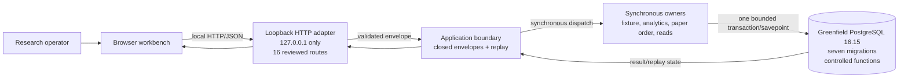

# WP-8 Implemented-State Architecture

**Date:** 2026-09-23  
**Status:** Implemented Ring 2 candidate; completion approved under DEC-089 but blocked on final Plaid pre-exit action; Ring 3 not authorized

## Scope

This view describes the code and executable integration candidate implemented by WP-8. It does not authorize release, deployment, production, public ingress, provider access, a broker, a worker, or SQL Server migration/conversion.

## Implemented Responsibilities

| Component | Implemented behavior | Current limitation |
| --- | --- | --- |
| Browser workbench | Accessible local watchlist and paper-order workflow | Not an authenticated multi-user client |
| Loopback HTTP adapter | Literal loopback binding, closed routes, bounded body/deadline, fixed public errors | Same-user processes can connect; no per-launch token or rate limit |
| Application boundary | Typed operation envelopes, command idempotency, replay, redaction | Complete composition is currently an integration fixture, not a product launcher |
| Synchronous owners | Fixture ingestion, analytics publication, paper-order transition, controlled reads | No independent worker process, scheduler, or provider adapter |
| PostgreSQL | Seven exact greenfield migrations, least-privilege roles, controlled functions, immutable evidence and replay | No backup/restore or production operations implementation |

## Structural Handoff Boundary

The candidate has no queue, outbox, broker, event stream, worker, scheduler, or cross-process durable handoff. PostgreSQL `jobs` are synchronous workflow state operated inside the current request transaction; they are not queue entries. Migration preflight rejects durable-handoff object names, and the live canonical catalog contains none.

This structural assertion is separate from saturation observations. CPU, memory, connection, and evidence-capacity measurements do not prove the absence of durable handoff.

## Observability State

Ring 2 tests collect bounded request latency, readiness recovery, redaction, database connections, evidence capacity, unresolved intents, reconciliation differences, and unexpected server errors. `evaluatePrototypeOperations` evaluates supplied observations. WP-8 does not implement a retained production logging, metrics, tracing, dashboard, or alerting pipeline.

## Deferred Future-State Elements

The following appear in proposed architecture views but are not implemented by WP-8:

- Kubernetes, Helm, pods, Jobs, and CronJobs.
- Ingestion, analytics, projection, audit, or job worker processes.
- PostgreSQL outbox or any durable event handoff.
- Provider adapters, network egress, credentials, or live market/economic ingestion.
- Production telemetry, backup/restore, HA/DR, public ingress, TLS, or multi-user identity.
- Brokerage, real orders, or credential transmission.

The proposed views remain design options only and must not be used as implementation evidence.

## Candidate Classification

WP-8 currently proves an executable local integration candidate. It does not yet provide a supported product composition root or documented local launch command. DP-33 must explicitly disposition whether that omission is accepted for Ring 2 or requires implementation before Ring 3.
